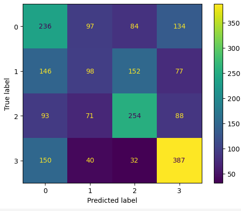

# CustomerSegmentation Neural Network (Numpy Python)
This is prediction of customer segmentation based on the given set of features using scratch Neural Network implementation in numpy python.

The model is completely underfitting and still I am not able to identify whether the **Dataset** is not correct and is biased or there is an error in my **Neural Network Implementation**

## Training and Validation

## Confusion Matrix

# Digit Classification Dataset Results

Training Loss: 5%
Test Loss: 7%

## Graph

## Confusion Matrix

